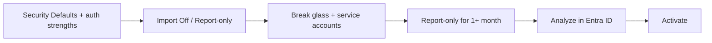

# Deploy this baseline

Bring the Cloud Shield Conditional Access baseline into a tenant, then turn it on safely — in this order.

Policies, groups, named locations, and the migration map live under [`Config/`](../Config/).

## Deployment steps

1. **Turn off Security Defaults**  
   They conflict with Conditional Access.

2. **Confirm authentication strengths**  
   Make sure the built-in **Multifactor authentication** and **Phishing-resistant MFA** strengths exist in the tenant.

3. **Import the baseline**  
   Import in **Off** or **Report-only** state — do not enforce on first import. Use either:

| Tool | Link | Notes |
|------|------|-------|
| **CA Importer** | [ca-importer.mikkeldamgaard.dk](https://ca-importer.mikkeldamgaard.dk) | Web app to import, export, and maintain this baseline across tenants. Uses [`MigrationTable.json`](../Config/MigrationTable.json) to remap IDs by display name. |
| **IntuneManagement** | [Micke-K/IntuneManagement](https://github.com/Micke-K/IntuneManagement) | PowerShell/GUI bulk import for CA policies, groups, and named locations. |

   After import, customize [named locations](named-locations.md) (country allow-lists, compliant networks) to match the customer.

4. **Break-glass accounts**  
   Create emergency access accounts, or reuse existing ones, and add them to `SGU - CSB - CA500-BreakGlassAccounts`.

> [!IMPORTANT]
> Break-glass accounts must be in that group **before** you activate policies.

5. **Service accounts**  
   Add automation / service accounts to `SGU - CSB - CA300-ServiceAccounts` if you use that persona.

6. **Report-only period**  
   Set the Conditional Access policies you intend to use to **Report-only**. Keep them in report-only for **at least one month** before activating.  
   We recommend starting with **[Level 1](levels.md)** and advancing from there (then Level 2, 3+, and Agents when those workloads exist).

7. **Analyze impact in Entra ID**  
   Review Conditional Access impact in Microsoft Entra ID — sign-in logs, What If, and related insights. Fix exclusions or scope before you enforce. Prefer narrow [per-policy excludes](exclusions.md); do not use Break glass for day-to-day exceptions.

8. **Activate**  
   Switch policies to **On** when the report-only impact looks acceptable. Activate in waves (by level), and watch sign-in logs after each wave.

## After changes in Git

When you change a policy in this repo:

1. Bump the `-v{major}.{minor}` suffix ([Naming](naming.md)).  
2. Pull the update in the target environment.  
3. Re-import the updated policies with CA Importer or IntuneManagement (Off / Report-only first).

Next: [Levels](levels.md) · [Exclusions](exclusions.md) · [Policies](policies.md)
