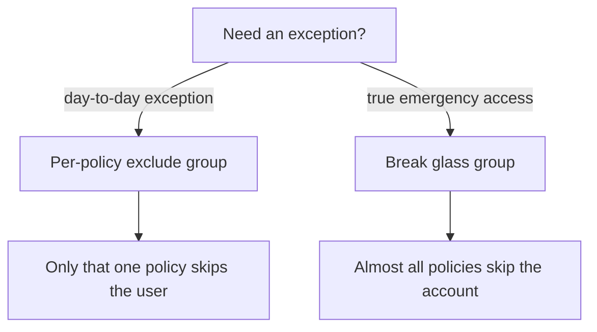

# Exclusions

Exclusions let you make a **narrow** exception without turning off Conditional Access.

## Three layers

| Layer | Group pattern | Use when |
|-------|---------------|----------|
| **Break glass** | `SGU - CSB - CA500-BreakGlassAccounts` | Emergency accounts only |
| **Per-policy** | `SGU - CSB - CA###-… - Exclude` | Exempt someone from **one** control |
| **Include** | `SGU - CSB - CA300-ServiceAccounts` | Put an account **into** the service-account persona |

Groups live under [`Config/Groups/`](../Config/Groups/).

## Break glass

> [!IMPORTANT]
> Populate break-glass accounts **before** you enforce policies. Do not use this group for everyday exceptions.

Break-glass accounts are excluded from most user-scoped policies so emergency access still works. Persona **500** also applies dedicated controls to those accounts (passkey, short sessions). See [Personas](personas.md).

## Per-policy excludes

Prefer the **smallest** exception:

1. One control → that policy’s `… - Exclude` group  
2. Service-account location → CA301 exclude (also kept in sync with country blocking where referenced)  
3. Emergency only → Break glass group  

Document why the exclusion exists and when it should end. Review membership regularly.

## Agents

Agent policies (CA400–404) currently ship with empty exclude lists. Review exclusions deliberately before production enablement.

## Import note

[`Config/MigrationTable.json`](../Config/MigrationTable.json) maps display names → IDs so imports remap groups correctly across tenants.

Next: [Deploy](deploy.md) · [Named locations](named-locations.md)
