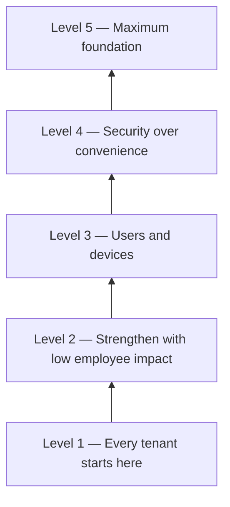

# Baseline levels

Levels show **where to start**. They are a recommended rollout order — our opinion on what matters most — not a hard security standard.

## Pick your level

| Level | Who it is for | What it means |
|------:|---------------|---------------|
| **1** | Every tenant | Put these policies in place whether you have 5 or 5,000 people. This is the floor. |
| **2** | Teams ready to harden | Strengthen security while keeping impact on standard employees low. |
| **3** | After critical assets | Admins, service accounts, and similar high-value identities are covered. Now raise the bar for users and devices. |
| **4** | Security-first orgs | You accept short workability hits. A blocked user for a day or two is better than a weak control. |
| **5** | Large / high-assurance | Maximum foundational posture for large enterprises or special environments. |

## How levels work with policies

Policy names include `LVL1` … `LVL4` so you can filter in Entra and Git.

| In Config | Docs meaning |
|-----------|--------------|
| `LVL1` | Level 1 |
| `LVL2` | Level 2 |
| `LVL3` | Level 3 |
| `LVL4` | Level 4 |
| *(no `LVL5` yet)* | Level 5 is documented as the top rung for future policies |

**Agents** (CA400–404) have no `LVL#` tag today. Treat them as a parallel track once agent workloads exist — usually after Level 2 or 3.

Full list: [Policy catalog](policies.md).

## Suggested path

1. Deploy **Level 1** (including break-glass hygiene).
2. Add **Level 2** when MFA and exclusions are stable.
3. Add **Level 3** when device management and risk signals are ready.
4. Add **Level 4** only when leadership accepts stricter guest and app limits.
5. Plan **Level 5** as the long-term target; no Level 5 policies ship in Config yet.

Next: [Personas](personas.md) · [Policies](policies.md) · [Deploy](deploy.md)
