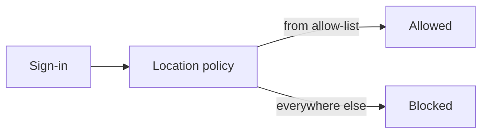

# Named locations

Named locations are allow-lists (or trusted networks) that location policies use. Customize them **per customer before** turning those policies on.

## Locations in this baseline

| Name | What it is | Typical use |
|------|------------|-------------|
| `ALLOWED COUNTRIES` | Country allow-list (template) | Global country block (CA001) |
| `ALLOWED COUNTRIES - SERVICE ACCOUNTS` | Tighter country list for automation | Service-account location pin (CA301) |
| `HIGH RISK COUNTRIES` | High-risk country list | High-risk country block (CA011) |
| `All Compliant Network locations` | Tenant compliant networks | Agent network requirement (CA404) |

JSON: [`Config/NamedLocations/`](../Config/NamedLocations/).

## How policies use them

Most location policies:

1. Include **All** locations  
2. **Exclude** the named allow-list  

Sign-ins from the allow-list pass that check; others are blocked (or challenged, depending on the policy).

## Customize per customer

- Set country codes to where people and automation actually work  
- Keep the service-account list separate when automation must be tighter than users  
- For CA404, configure Global Secure Access / compliant networks so the compliant-network location is meaningful  

Keep display names stable — import remapping relies on them via [`MigrationTable.json`](../Config/MigrationTable.json).

Next: [Deploy](deploy.md) · [Exclusions](exclusions.md)
