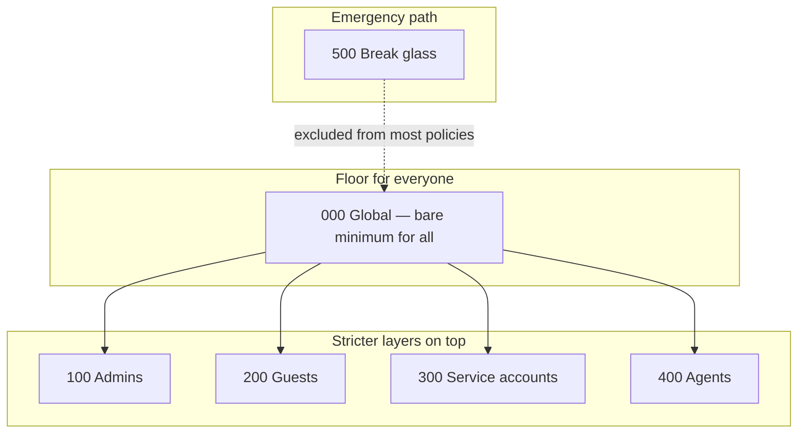

# Personas

Personas answer **who** a policy protects. Number bands make policies easy to scan in Entra and in Git.

## At a glance

| Band | Persona | Plain-language role |
|------|---------|---------------------|
| **000** | Global | Catch-all rules everyone must meet |
| **100** | Admins | Privileged admin roles — tighter than Global |
| **200** | Guests | External / B2B users — limited reach and sessions |
| **300** | Service accounts | Automation accounts in a dedicated group |
| **400** | Agents | AI / agent identities and agent users |
| **500** | Break glass | Emergency access only — separate, tightly controlled |

## 000 Global

These policies are the **floor**. In general they apply across persona groups as catch-alls.

Think of them as the bare minimum everyone at least follows. Other personas may add stronger rules on top. Exclusions from Global policies should be rare and carefully considered.

Examples: MFA catch-all, block legacy authentication, MFA when registering a device.

## 100 Admins

Policies for people with **privileged Entra roles** (Global Admin, Security Admin, Conditional Access Admin, and other high-impact roles).

Admins are high-value targets, so this persona raises the bar: stronger MFA, shorter sessions, stricter evaluation.

## 200 Guests

Policies for **guests and other external users** (B2B collaboration, direct connect, and similar).

Guests should not get the same access surface as employees. This persona requires MFA, limits apps and admin portals, and hardens sessions.

## 300 Service accounts

Policies for **automation and non-interactive accounts** that still sign in somehow.

These identities are **included** via the `SGU - CSB - CA300-ServiceAccounts` group (not “all users”). Controls focus on MFA and trusted locations.

Prefer managed / workload identities when you can; use this persona for accounts that still need Conditional Access coverage.

## 400 Agents

Policies for **Microsoft Entra agent identities and agent users**.

Default stance is restrictive: block high-risk agents, deny broad agent-resource access unless allowed, require compliant devices and trusted networks where relevant.

Validate licensing and compliant-network setup before enabling. See [Named locations](named-locations.md).

## 500 Break glass

Policies for **emergency access accounts** only.

Break-glass accounts must still work when MFA or other controls fail — and must stay tightly controlled (strong authentication, short sessions, no persistent browser).

> [!IMPORTANT]
> Add break-glass accounts to the Break glass exclude group **before** you enforce other policies. See [Exclusions](exclusions.md).

Most other policies exclude these accounts so emergency access is not locked out by the baseline itself.

Next: [Levels](levels.md) · [Policies](policies.md) · [Exclusions](exclusions.md)
