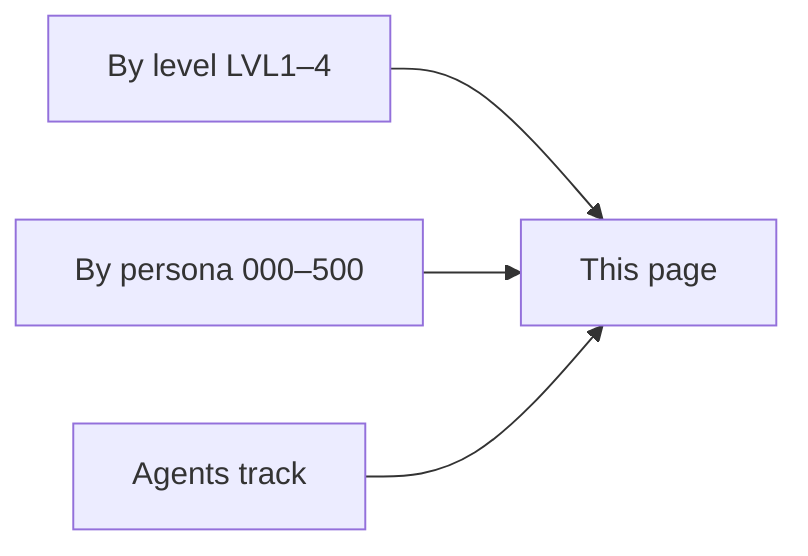

# Policy catalog

One list of policies in this baseline. Source of truth: [`Config/ConditionalAccess/`](../Config/ConditionalAccess/).

Browse by [level](#by-level) or by [persona](#by-persona). Intent lines are short summaries — open the JSON for exact conditions.

> [!NOTE]
> Files named `Catalog-*` are alternate / catalog copies. The tables below prefer the main `CA###-CSB-…` file. **CA001** (country allow-list) and **CA100** (admin MFA) currently live only as `Catalog-CA001` / `Catalog-CA100`.

---

## By level

### Level 1 — Every tenant

| ID | Persona | Intent |
|----|---------|--------|
| CA000 | Global | MFA for all users (catch-all) |
| CA002 | Global | Block legacy authentication |
| CA003 | Global | MFA when registering or joining a device |
| CA008 | Global | MFA when registering security info |
| CA100 | Admins | MFA for privileged admin roles |
| CA102 | Admins | Sign-in frequency (admins) |
| CA103 | Admins | Never persistent browser (admins) |
| CA200 | Guests | MFA for guests / external users |
| CA300 | Service accounts | MFA for service accounts group |
| CA500 | Break glass | Require passkey for break-glass accounts |
| CA501 | Break glass | Sign-in frequency for break-glass |
| CA502 | Break glass | Never persistent browser for break-glass |

### Level 2 — Strengthen, low employee impact

| ID | Persona | Intent |
|----|---------|--------|
| CA004 | Global | Block authentication transfer |
| CA005 | Global | Block device code flow |
| CA013 | Global | Sign-in frequency on unmanaged devices |
| CA015 | Global | Block unwanted platforms |
| CA022 | Global | MFA for Microsoft admin portals |
| CA101 | Admins | Phishing-resistant MFA for admins |
| CA105 | Admins | Phishing-resistant MFA when registering security info |
| CA106 | Admins | Disable auth resilience defaults for admins |
| CA202 | Guests | Sign-in frequency (guests) |
| CA203 | Guests | Never persistent browser (guests) |
| CA205 | Guests | Block high sign-in risk (guests) |
| CA301 | Service accounts | Block service accounts outside allowed countries |

### Level 3 — Users and devices

| ID | Persona | Intent |
|----|---------|--------|
| CA006 | Global | App-enforced restrictions for unmanaged browser Office 365 |
| CA009 | Global | Block high sign-in risk |
| CA010 | Global | High user risk → phishing-resistant MFA remediation |
| CA011 | Global | Block high-risk countries |
| CA012 | Global | Continuous Access Evaluation (Office 365) |
| CA014 | Global | Never persistent browser on unmanaged devices |
| CA016 | Global | Require compliant Windows devices |
| CA017 | Global | Require compliant macOS devices |
| CA018 | Global | Require compliant Android devices |
| CA019 | Global | Require compliant iOS devices |
| CA020 | Global | App protection for unmanaged iOS |
| CA021 | Global | App protection for unmanaged Android |
| CA104 | Admins | Continuous Access Evaluation (strict location) for admins |
| CA107 | Admins | Block high sign-in risk for admins |

### Level 4 — Security over convenience

| ID | Persona | Intent |
|----|---------|--------|
| CA201 | Guests | Block guests from non-guest apps |
| CA204 | Guests | Block guests from Microsoft admin portals |
| CA206 | Guests | Block high user risk (guests) |

### Level 5

No `LVL5` policies in Config yet. See [Levels](levels.md).

### Agents track (no LVL tag)

Enable when you use agent identities / agent users — typically after Level 2 or 3.

| ID | Persona | Intent |
|----|---------|--------|
| CA400 | Agents | Block high-risk agent identities |
| CA401 | Agents | Deny-by-default agent identity → agent resources |
| CA402 | Agents | Compliant device for agent users |
| CA403 | Agents | Block medium/high risk agent users |
| CA404 | Agents | Require compliant network for agent users |

### Country allow-list (no LVL tag)

| ID | Persona | Intent |
|----|---------|--------|
| CA001 | Global | Block sign-ins outside `ALLOWED COUNTRIES` |

---

## By persona

### 000 Global

CA000, CA001, CA002, CA003, CA004, CA005, CA006, CA008, CA009, CA010, CA011, CA012, CA013, CA014, CA015, CA016, CA017, CA018, CA019, CA020, CA021, CA022

### 100 Admins

CA100, CA101, CA102, CA103, CA104, CA105, CA106, CA107

### 200 Guests

CA200, CA201, CA202, CA203, CA204, CA205, CA206

### 300 Service accounts

CA300, CA301

### 400 Agents

CA400, CA401, CA402, CA403, CA404

### 500 Break glass

CA500, CA501, CA502

---

## Related

- [Levels](levels.md) — where to start
- [Personas](personas.md) — who policies protect
- [Naming](naming.md) — how names are built
- [Deploy](deploy.md) — import and enable safely
